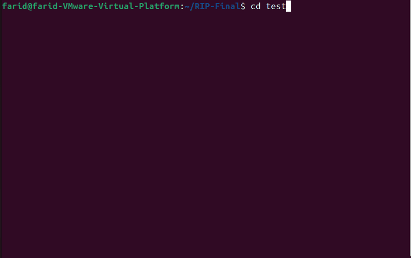
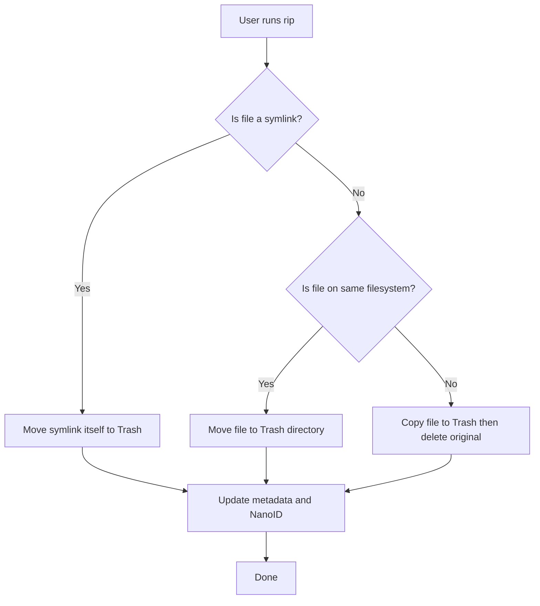

# rip-safe — Safe, Fast, Symlink-Aware Replacement for `rm`


[](https://github.com/faridhassani95/safe-rip/stargazers)
[](https://crates.io/crates/safe-rip)

<p align="center">
<p align="center">
  
</p>

Delete files safely. Restore instantly. Never follow symlinks by mistake.

---

## Why Rust?

`rip` is implemented in **Rust** for multiple key reasons:

* **Speed:** Compiled Rust binaries run extremely fast, ideal for CLI tools.
* **Memory Safety:** Rust prevents common bugs like use-after-free or double-free.
* **Tiny Static Binaries:** No runtime dependencies; portable across Linux and macOS.
* **Reliability:** Perfect for system utilities managing critical files, folders, and symlinks.

Rust allows us to combine **safety**, **performance**, and **robustness**, solving problems that are tricky in shell scripts or Python-based tools.

---

## Challenges in Linux

Deleting files in Linux seems trivial, but there are multiple edge cases:

1. **Cross-Device Moves:** `mv` fails with `EXDEV` when moving files between filesystems (like external drives or network mounts).

   * **Solution in rip:** Automatically **copy + delete** when cross-device moves occur.

2. **Symlink Safety:** Traditional `rm` can follow symlinks accidentally, deleting unintended files.

   * **Solution in rip:** Uses `symlink_metadata()` to detect symlinks, deletes only the link itself, handles broken links gracefully.

3. **Safe Restore:** Restoring files can conflict with existing paths.

   * **Solution in rip:** Auto-renames restored files to avoid overwrites.

4. **Persistent Auto-Cleanup:** Existing trash utilities rarely support policies like deleting after N days or asking before cleanup.

   * **Solution in rip:** Provides configurable policies (`ask`, `never`, `30d`) for automated management.

---

## Features

* 100% Freedesktop Trash compliant (Nautilus, Dolphin, Thunar).
* Symlink-safe: never deletes the target; handles broken symlinks.
* Cross-device aware: automatically moves files across filesystems.
* Smart restore: renames files to avoid conflicts.
* Persistent auto-cleanup policies.
* Tiny binary (~1.5 MB) with zero runtime dependencies.

---

## Flowchart: File Deletion Process



---

## Installation

### From crates.io

```bash
cargo install rip
```

### From source

```bash
git clone https://github.com/faridhassani95/rip.git
cd rip
cargo build --release
sudo cp target/release/rip /usr/local/bin/
```

### Optional Safety Alias

```bash
echo "alias rm='rip'" >> ~/.bashrc   # or ~/.zshrc
source ~/.bashrc
```

---

## Usage

```bash
rip file.txt folder/ symlink      # Move to trash
rip --list                        # List trashed items
rip --restore 1                   # Restore newest item
rip --empty                        # Permanently empty trash
rip --keep 30d                     # Auto-delete items older than 30 days
rip --keep ask                     # Ask before cleaning old items
rip --keep never                   # Disable auto-clean
rip --keep                         # Show current policy
```

---

## Comparison with Other Trash Tools

| Feature                           | rip (Rust)                    | trash-cli (Python)  | gio trash (GNOME) | rm (coreutils) |
| --------------------------------- | ----------------------------- | ------------------- | ----------------- | -------------- |
| Language                          | Rust (native)                 | Python              | C++/GLib          | C              |
| Never follows symlinks            | ✅ Yes (symlink_metadata)      | ⚠️ Yes (dangerous)  | Sometimes         | ❌ Always       |
| Broken symlink handling           | ✅ Graceful (/RIP_BROKEN_LINK) | ⚠️ Warnings / crash | Inconsistent      | N/A            |
| Cross-filesystem move (EXDEV)     | ✅ Auto copy + delete          | ❌ Fails             | ✅ Yes             | N/A            |
| Restore when original path exists | ✅ Auto-rename                 | ⚠️ Overwrites       | ❌ Fails           | N/A            |
| Auto-cleanup policies             | ✅ ask • never • 30d           | ❌ No                | ❌ No              | N/A            |
| Unique trash filenames (NanoID)   | ✅ Yes                         | ❌ No                | ❌ No              | N/A            |
| Binary size                       | ~1.5 MB                       | 15+ MB              | System library    | <100 KB        |
| Install with cargo install rip    | ✅ Yes                         | ❌ No                | ❌ No              | Pre-installed  |

**Verdict:** `rip` is the only CLI trash tool combining Rust speed, symlink safety, cross-device support, and persistent auto-cleanup policies.

---

## License

MIT © Farid

Built with ❤️ and 🦀 — stop deleting, start ripping.
